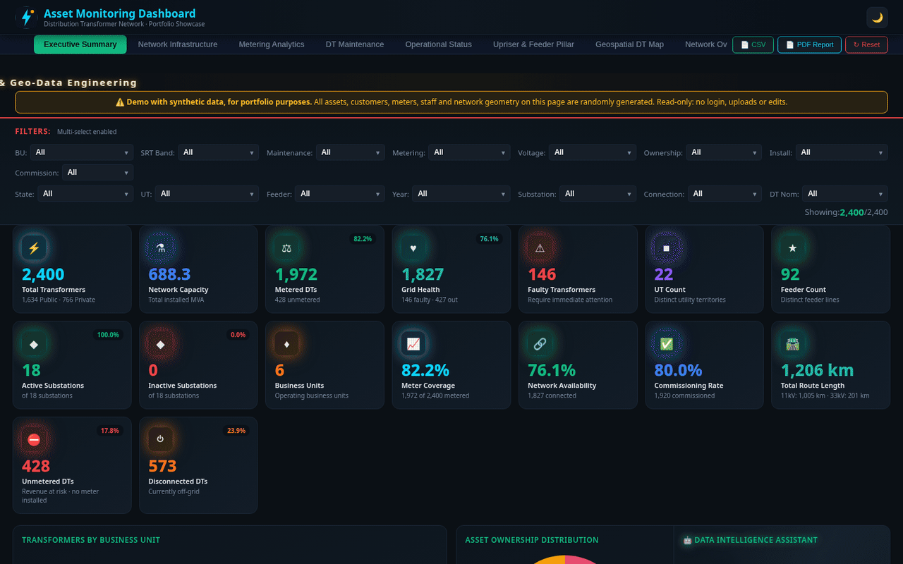
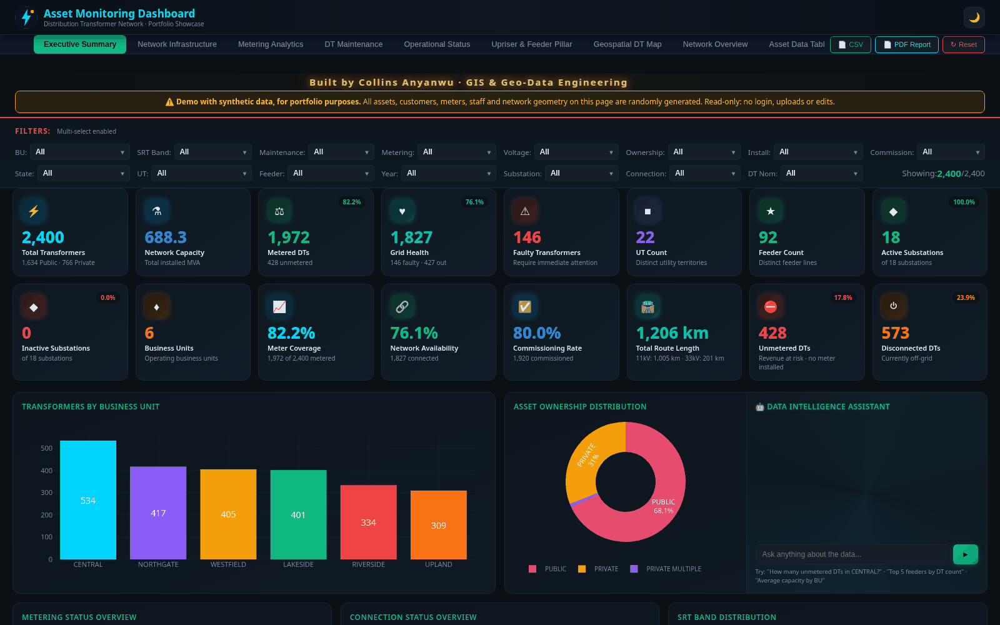
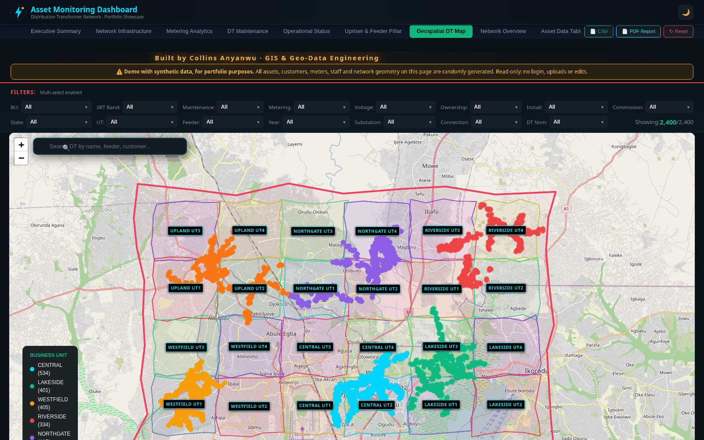
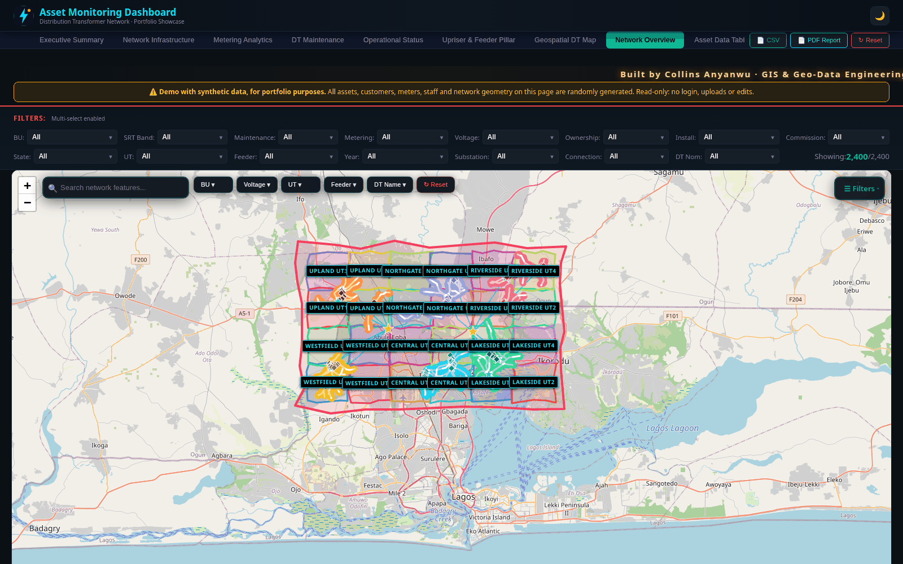
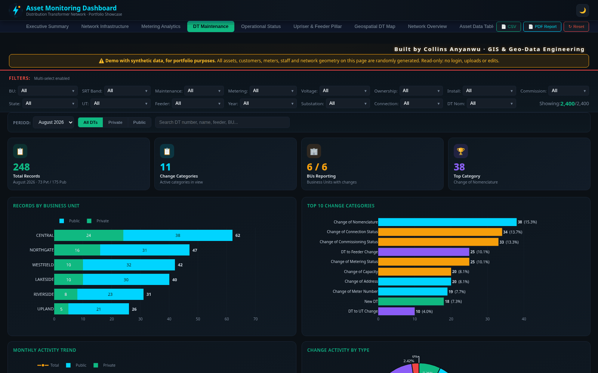
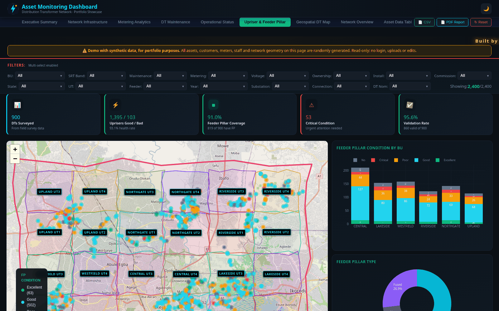
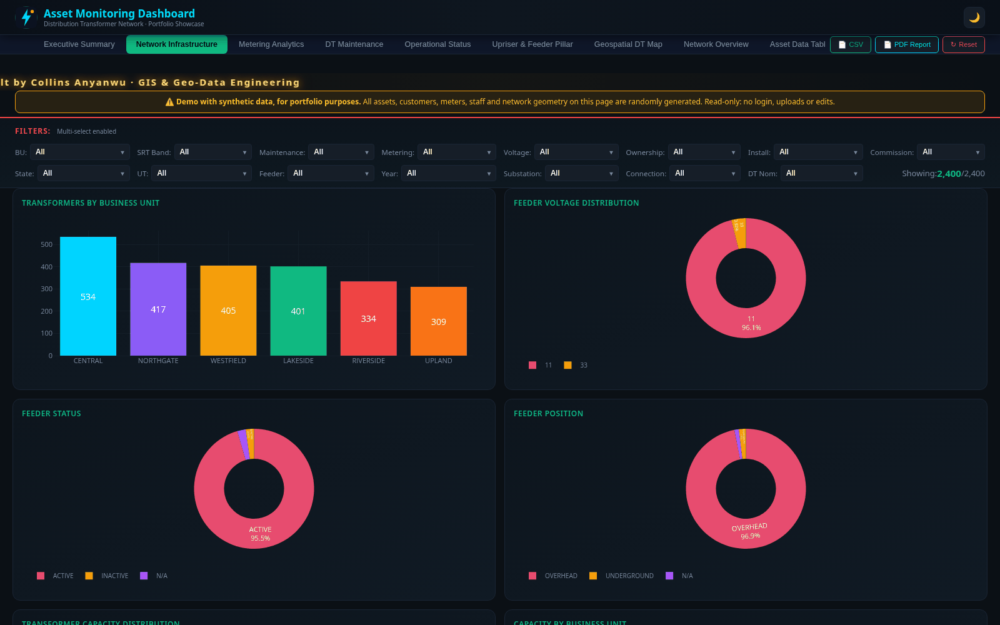
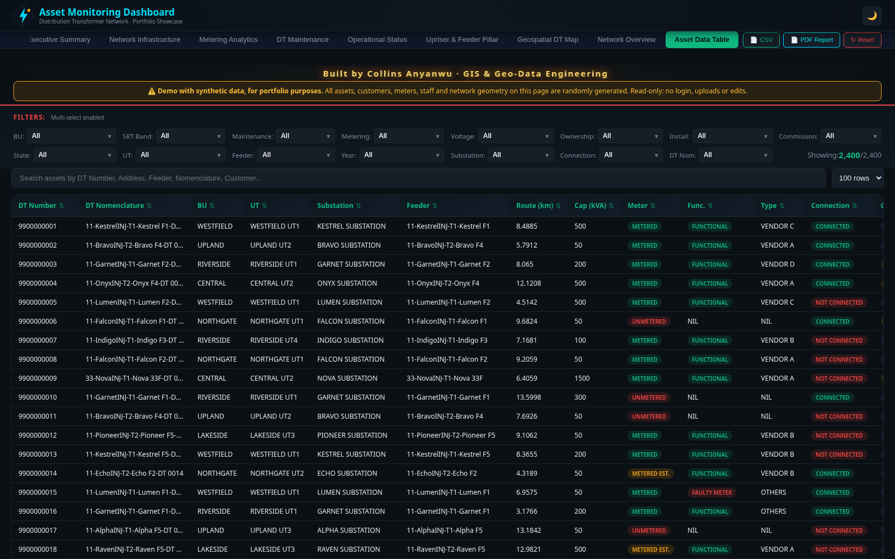

# Asset Monitoring Dashboard: Showcase

**Live demo:** https://collins-geodev.github.io/ie-asset-dashboard-showcase/

[](https://collins-geodev.github.io/ie-asset-dashboard-showcase/)

> ⚠️ **Demo with synthetic data, for portfolio purposes.**
> Every transformer, customer, meter number, staff name, address and network line in this repository is **randomly generated** (see [`scripts/gen_data.py`](scripts/gen_data.py)).
> The production version of this dashboard runs on **private utility data behind authentication** and is not public. This copy is a **read-only**, fully client-side display: no login, no uploads, no edits, no backend calls.

A GIS-driven dashboard for monitoring a power-distribution network: distribution transformers (DTs), feeders, injection substations, metering and field-survey results. It's built for a utility GIS team that needs one place to see the asset register, find data-quality gaps and track monthly change requests.



## Features

| Page | What it shows |
|---|---|
| **Executive Summary** | 16 KPI cards (DT count, installed capacity, metering coverage, grid health, route length...), BU and ownership breakdowns, and an offline "data assistant" that answers natural-language questions from the loaded data |
| **Network Infrastructure** | Feeder voltage, feeder status and position, transformer capacity mix per business unit |
| **Metering Analytics** | Metered vs unmetered DTs, meter functionality, prepaid vs postpaid, meter type and platform, coverage by BU |
| **DT Maintenance** | Monthly change log (new DTs, feeder or UT moves, nomenclature, capacity and meter changes) with period switcher, Private/Public split, charts, search, CSV and PDF export |
| **Operational Status** | Connection, commissioning and disconnection status, SRT bands, asset creation trend, installation position |
| **Upriser & Feeder Pillar** | Field-survey results on a map with condition and type charts and a filterable survey table |
| **Geospatial DT Map** | Every DT on a Leaflet map (canvas renderer), coloured by BU, with UT boundaries, multiple basemaps, search and popups |
| **Network Overview** | Layered network map: grid stations, injection substations, 33 kV and 11 kV lines, DT points per BU, with a layer and filter panel and feeder tracing |
| **Asset Data Table** | Searchable, sortable, paginated register with autocomplete |

The same set of cross-filters (BU, UT, feeder, substation, voltage, metering, ownership, year...) drives every page. It also has a light/dark theme, CSV export and a printable PDF report.

| | |
|---|---|
|  |  |
|  |  |
|  |  |

## Tech stack

- **Front end:** a single-page HTML/CSS/vanilla JavaScript app with no build step
- **Charts:** Plotly.js
- **Maps:** Leaflet with a canvas renderer, OpenStreetMap / Esri basemaps, GeoJSON layers
- **Export:** SheetJS (CSV/XLSX) and a browser print-to-PDF report
- **Data:** static JS bundles in `data/`, made by a seeded Python generator (`scripts/gen_data.py`)
- **Hosting:** GitHub Pages

In production, the dashboard also has authentication with role-based access, an audit log, admin Excel/GeoJSON/KML uploads and a serverless backend for cross-device sync. A GitHub Actions pipeline rebuilds the data bundles from the source asset register. **All of that has been removed from this showcase.**

## Data

| File | Contents (all synthetic) |
|---|---|
| `data/dashboard_data.js` | 2,400 fake transformers (`DT 0001`...), fake customers (`Customer 0001`...), fake meter numbers (`DEMO-########`) |
| `data/ie_network_overview.js` | Generated service area, UT cells, 3 grid stations, 18 fictional substations, random-walk feeder lines |
| `data/upriser_feeder_pillar.js` | 900 fake survey records (`Field Officer 01`...), no photos |
| `data/sample_maintenance.js` | 3 months of fake DT change records |

The business units (Central, Northgate, Westfield, Upland...), substations (Alpha, Bravo...) and feeders are made up. Coordinates are random points inside a generic box on the Lagos mainland, so they don't represent real assets. To make a different dataset, change the seed and run:

```bash
python3 scripts/gen_data.py
```

## Run locally

```bash
python3 -m http.server 8000   # then open http://localhost:8000
```

## Author

**Collins Anyanwu**: GIS & geo-data engineering · [GitHub](https://github.com/collins-geodev)
